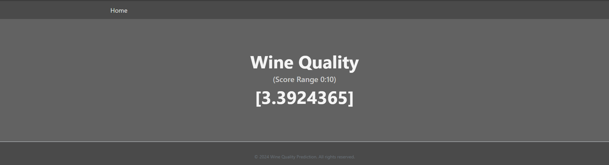

# Wine Quality Prediction

## End-to-end-Machine-Learning-Project-with-MLflow-AWS-GitHub-Actions

This repository contains an end-to-end machine learning pipeline built using MLOps practices and integrated with MLflow for experiment tracking. The pipeline handles various stages such as data ingestion, validation, transformation, model training, and evaluation. The project also includes a Flask web application to predict wine quality.

## Project Overview

The goal of this project is to build an end-to-end machine learning pipeline for predicting wine quality based on physicochemical properties of the wine. The pipeline is modular, allowing easy management and execution of different stages using MLOps principles.

Key features:
- Data ingestion from a source URL.
- Data validation based on a predefined schema.
- Data transformation including training and testing dataset splits.
- Model training using ElasticNet regression.
- Model evaluation with metrics tracked via MLflow.
- A Flask web app for real-time predictions.

## Pipeline Stages

1. **Data Ingestion**  
   Downloads and extracts the dataset from a source URL.

2. **Data Validation**  
   Validates the dataset against a predefined schema.

3. **Data Transformation**  
   Splits the dataset into training and testing sets.

4. **Model Training**  
   Trains the ElasticNet model using the training dataset.

5. **Model Evaluation**  
   Evaluates the model on the test dataset using metrics like RMSE, MAE, and R-squared, with results logged into MLflow.

## Web Application

A Flask web app is provided to make predictions on new wine data. Users can input wine attributes (e.g., acidity, sugar, etc.), and the model will predict the quality of the wine.

## Workflows Update order

1. config.yaml
2. schema.yaml
3. params.yaml
4. entity
5. configuration manager in src config
6. components
7. pipeline
8. main.py
9. app.py

## How to run?

### STEPS:

Clone the repository using Bash or CMD

```bash
https://github.com/Gouranga-GH/ETEP-MLOps-MLflow-AWS
```

### STEP 01- Create a conda environment after opening the repository

```bash
conda create -n venv python=3.8 -y
```

```bash
conda activate venv
```

### STEP 02- install the requirements

```bash
pip install -r requirements.txt
```

### STEP 03- Run the Flask app

```bash
python app.py
```

Now, open up your local host and port to access the app.

## MLflow

[Documentation](https://mlflow.org/docs/latest/index.html)

### CMD

```bash
mlflow ui
```

### DagsHub

To track your experiments with DagsHub:

[dagshub](https://dagshub.com/)

```bash
MLFLOW_TRACKING_URI=Deleted_Security_Concerns
MLFLOW_TRACKING_USERNAME=Deleted_Security_Concerns \
MLFLOW_TRACKING_PASSWORD=Deleted_Security_Concerns \
python script.py
```

Run this to export environment variables:

```bash
export MLFLOW_TRACKING_URI=Deleted_Security_Concerns
export MLFLOW_TRACKING_USERNAME=Deleted_Security_Concerns
export MLFLOW_TRACKING_PASSWORD=Deleted_Security_Concerns
```

Alternatively for Windows (CMD):

```bash
setx MLFLOW_TRACKING_URI "Deleted_Security_Concerns"
setx MLFLOW_TRACKING_USERNAME "Deleted_Security_Concerns"
setx MLFLOW_TRACKING_PASSWORD "Deleted_Security_Concerns"
```

Use `setx` for permanent environment variables, `set` for session usage.

## AWS CI/CD with GitHub Actions

- Login to AWS Console
- Create IAM User with EC2 and ECR access
- Create ECR Repository
- Create EC2 Machine (Ubuntu)
- Install Docker on EC2
- Configure EC2 as Self-Hosted Runner
- Setup GitHub Secrets


## Installation

### Prerequisites
- Python 3.8 or higher
- Docker (for containerization)
- MLflow account (optional for experiment tracking)

## App Images





## License

This project is licensed under the MIT License - see the [LICENSE](LICENSE) file for details.
